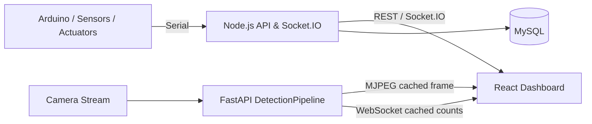

# Smart Farm Dashboard

실내 방울토마토 재배 환경을 모니터링하고 제어하기 위해 개발한 IoT 스마트팜 프로젝트입니다.  
React 대시보드, Node.js/Socket.IO 서버, Arduino 센서·제어부, MySQL, FastAPI 기반 영상 스트리밍과 YOLO 객체 탐지를 하나의 흐름으로 연결했습니다.

## Architecture



### Main components

| 영역 | 역할 |
| --- | --- |
| `front-end/` | React 기반 센서·제어·통계·영상 대시보드 |
| `back-end/` | Express, Socket.IO, SerialPort, MySQL/Mongo 연동 |
| `arduino_from_nodejs/` | 센서 수집 및 LED·펌프 등 장치 제어 |
| `mjpg-stream/` | FastAPI + Ultralytics YOLO 기반 영상 스트리밍·탐지 |

## Key Features

- 온도·습도·토양 수분·수위·조도 등 환경 데이터 모니터링
- Socket.IO 기반 센서 상태와 제어 상태 실시간 반영
- 웹 화면에서 LED·급수 장치 등 제어 요청
- MySQL 누적 데이터를 이용한 날짜별 통계 시각화
- MJPEG 카메라 스트리밍
- YOLO 기반 토마토 상태 및 잎 질병 탐지
- 탐지 결과를 WebSocket count 데이터와 영상 스트림에서 공유

## Detection Pipeline Refactoring

초기 FastAPI 구현은 스트리밍 라우트와 WebSocket handler가 각각 모델 추론을 직접 수행했습니다.

```text
Before

StreamingResponse -> YOLO inference -> render -> JPEG encode -> yield
WebSocket         -> YOLO inference -> class count -> send
```

이 구조에서는 응답 경로가 모델 추론 시간에 직접 종속되고, 같은 모델의 결과를 영상과 통계에서 따로 계산할 수 있었습니다.

현재 구현은 `DetectionPipeline`이 백그라운드에서 추론을 수행하고 최신 결과를 캐싱합니다.

```text
After

Camera
  -> DetectionPipeline
      -> YOLO inference
      -> latest_jpeg
      -> latest_counts
           |                |
           v                v
   StreamingResponse    WebSocket
```

관련 코드:

- `mjpg-stream/detection.py` — `DetectionPipeline`, 추론·JPEG 인코딩·count 캐시
- `mjpg-stream/responses.py` — 캐시된 결과를 스트리밍/WebSocket 응답으로 변환
- `mjpg-stream/main.py` — 모델별 pipeline lifecycle 및 API endpoint
- `mjpg-stream/config.py` — 추론 FPS, 이미지 크기, OpenVINO 사용 여부 등 설정

## Performance Verification

### Reproducible microbenchmark

`mjpg-stream/benchmark_optimization.py`는 `SyntheticCamera`를 사용해 기존 방식과 캐시 파이프라인의 요청 처리 비용을 비교할 수 있습니다. 실제 YOLO 모델을 사용한 실행도 지원합니다.

```bash
cd mjpg-stream
python benchmark_optimization.py --runs 5 --frames 180
python benchmark_optimization.py \
  --runs 5 \
  --frames 180 \
  --real-model \
  --model-path models/tomato_re_detect.pt \
  --imgsz 640
```

이 benchmark는 **서버 내부 처리 비용을 비교하는 microbenchmark**이며, 실제 카메라 입력·네트워크 전송·브라우저 렌더링까지 포함한 end-to-end latency 측정은 아닙니다.

### Historical device measurements

개발 당시 장비에서 기록한 영상 처리 FPS는 다음과 같습니다.

| 측정 환경 | 개선 전 | 개선 후 |
| --- | ---: | ---: |
| Intel Core i5-1135G7 / NVIDIA MX450 | 1–3 fps | 12–13 fps |
| AMD Ryzen 5 2600 / NVIDIA GTX 1060 3GB | 1–2 fps | 7–9 fps |

> 위 장비 수치는 프로젝트 개발 과정에서 기록한 관측값입니다. 당시의 원시 측정 로그·스크린샷은 저장소에 보존되어 있지 않으므로, 재현 가능한 구조 비교는 위 benchmark script를 기준으로 확인하는 것을 권장합니다.

## Local Setup

### 1. Frontend

```bash
cd front-end
cp .env.example .env
pnpm install
pnpm dev
```

기본 Node.js 서버 주소는 `VITE_SERVER_URL=http://localhost:3100`으로 예시가 제공됩니다.

### 2. Node.js backend

```bash
cd back-end
cp .env.example .env
npm install
npm start
```

필요한 환경변수 이름은 `back-end/.env.example`을 참고하세요. 실제 API key, DB 비밀번호, JWT secret은 저장소에 커밋하지 않습니다.

### 3. FastAPI / YOLO server

```bash
cd mjpg-stream
python -m venv .venv
# activate the virtual environment
pip install -r requirements.txt
```

카메라 스트림 주소는 환경변수로 지정할 수 있습니다.

Linux / macOS:

```bash
export CAMERA_STREAM_URL=http://localhost:8000/stream.mjpg
python main.py
```

PowerShell:

```powershell
$env:CAMERA_STREAM_URL="http://localhost:8000/stream.mjpg"
python main.py
```

지정하지 않으면 `http://localhost:8000/stream.mjpg`를 기본값으로 사용합니다.

### 4. Arduino

`arduino_from_nodejs/arduino_from_nodejs.ino`에는 DHT11, 토양 수분, 수위, 조도, 초음파 센서와 RGB LED·워터펌프 제어 로직이 포함되어 있습니다.

## Repository Hygiene

- `.env` 파일은 추적하지 않고 `.env.example`만 제공합니다.
- `node_modules`, Python `__pycache__`, 빌드 산출물은 Git에서 제외합니다.
- 모델 파일은 현재 저장소에 포함되어 있으므로 clone 용량이 큰 편입니다. 향후 Git LFS 또는 Release artifact로 분리할 수 있습니다.

## Troubleshooting Highlights

- **영상/추론 병목**: 요청 handler 내부 추론을 `DetectionPipeline`으로 분리하고 결과 캐시 공유
- **중복 추론**: MJPEG와 WebSocket이 동일 pipeline의 결과를 재사용
- **Socket lifecycle**: React 렌더링 과정의 연결 재생성을 줄이기 위해 provider/custom hook 기반으로 정리
- **CPU 환경 대응**: 추론 FPS·입력 크기 제한 및 OpenVINO 모델 우선 로딩 지원

## Stack

**Frontend**  
React 19 · Vite · Zustand · Socket.IO Client · Chart.js / Nivo

**Backend**  
Node.js · Express · Socket.IO · SerialPort · MySQL · MongoDB · JWT

**Vision**  
FastAPI · OpenCV · Ultralytics YOLO · PyTorch · OpenVINO

**Hardware**  
Arduino · DHT11 · Soil Moisture · Water Level · Light · Ultrasonic · RGB LED · Water Pump
